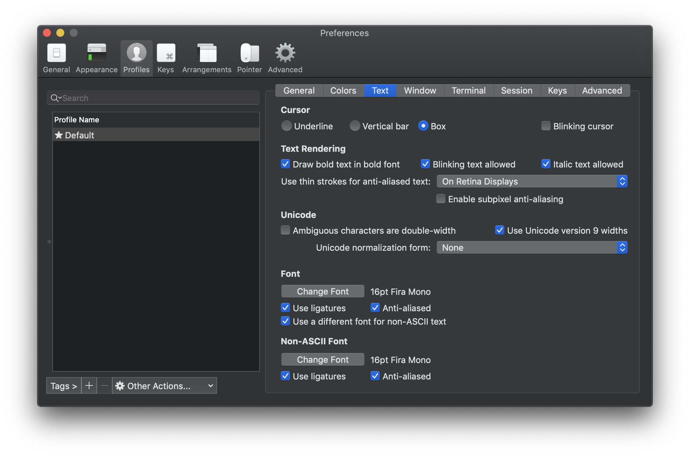
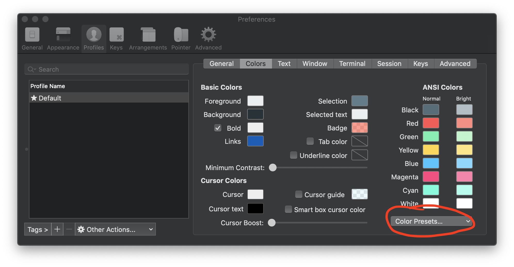
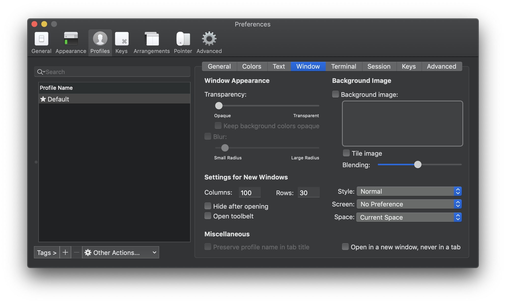

# MY CONFIG

##### All my Mac configurations for a fast installation from zero with brew ! 
<br>

# iTerm

- install iTerm
- install  [Brew](https://brew.sh)
- install [Fontpowerline](https://github.com/powerline/fonts) ( download zip )
- Install [Material theme iTerm](https://github.com/MartinSeeler/iterm2-material-design) ( run .sh file on terminal )


#### Custom font iTerm


#### Custom color iTerm (material-design-color)


#### fix size window iTerm
  
<br />

#### Run command 
Only after brew install.

```
curl -sSL https://raw.githubusercontent.com/alexlechot/-myConfig/master/install.sh | sh
```
<br>

# Not in install.sh

- [Adobe Creative Cloud](https://www.adobe.com/ch_fr/creativecloud/desktop-app.html)
- [Code notes](https://electronjs.org/apps/code-notes)
- [Alfred 3]() 
- Spark (App Store) 
- xCode (App Store)
- Pages (App Store)

<br>

# Brew commande
```
 brew search packages
 brew install packages
 brew cask install packages
 brew remove packages
 brew cask remove 
```
#### Verify if brew config is okay
`brew doctor`


<hr>
<br>

&copy; 2018 [AlexLechot](http://alexlechot.ch)
