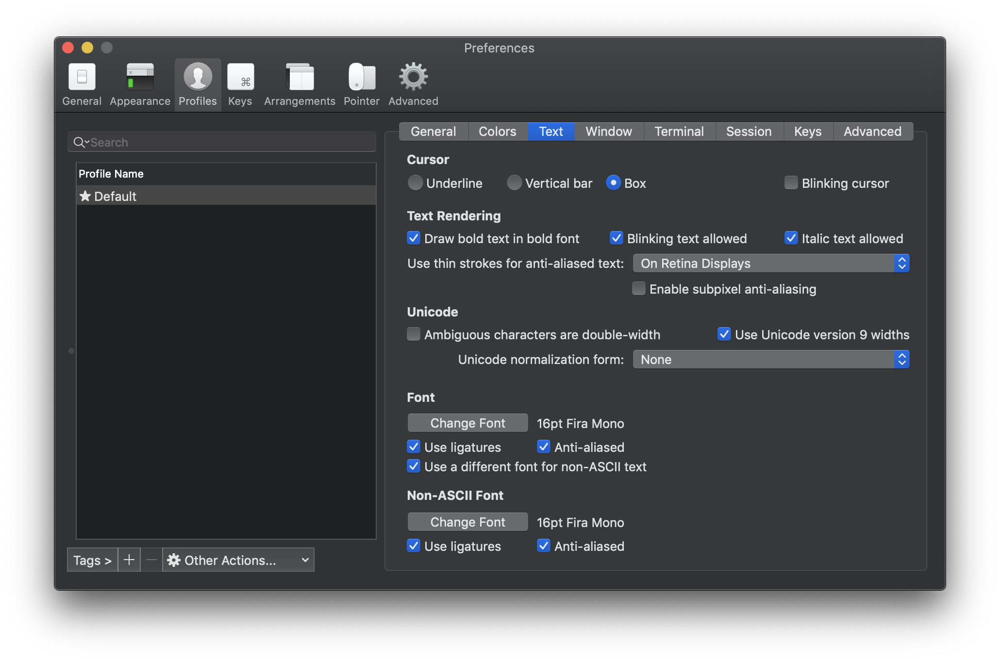
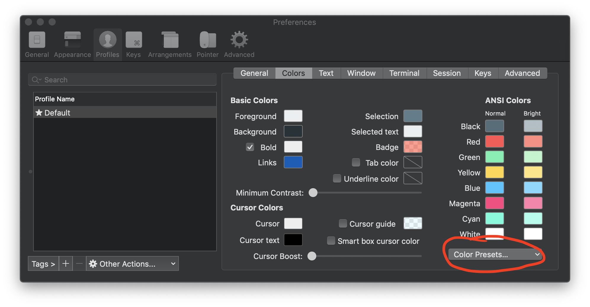
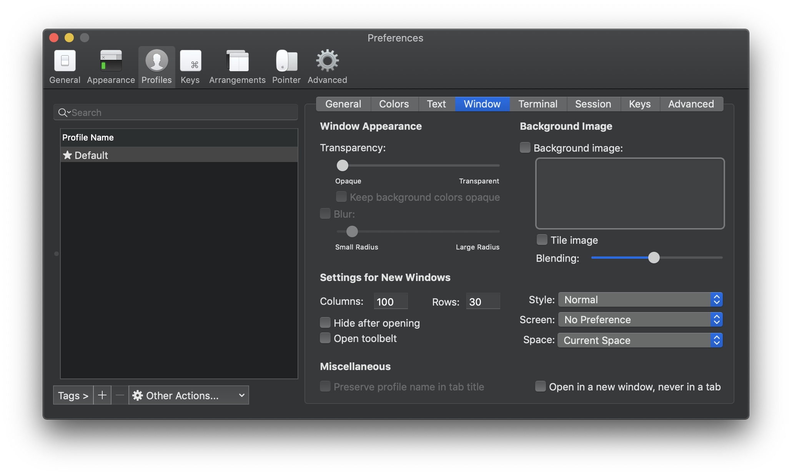

# MY CONFIG

##### All my Mac configurations for a fast installation from zero with brew ! 
<br>

# iTerm

- install [iTerm](https://iterm2.com)
- install [Brew](https://brew.sh)
- install [Fontpowerline](https://github.com/powerline/fonts) ( download zip )
- Install [Material theme iTerm](https://github.com/MartinSeeler/iterm2-material-design) ( run .sh file )


#### Custom font iTerm


#### Custom color iTerm (material-design-color)


#### Fix size window iTerm
  

#### Custom tabs iTerm
  

<br />

#### Run command 
Only after brew install.

```
curl -sSL https://raw.githubusercontent.com/alexlechot/-myConfig/master/install.sh | sh
```
<br>


# Not in install.sh

- [ ] [Adobe Creative Cloud](https://www.adobe.com/ch_fr/creativecloud/desktop-app.html)
- [ ] [Code notes](https://electronjs.org/apps/code-notes)
- [ ] Spark (App Store) 
- [ ] xCode (App Store)
- [ ] Pages (App Store)
- [ ] Numbers (App Store)
- [ ] MindNode (App Store)
<br>


# Brew commande
```
 brew search packages
 brew install packages
 brew cask install packages
 brew remove packages
 brew cask remove 
```
#### Verify if brew config is okay
```
brew doctor
```
<br>


# Install Fish theme + plugin
```sh
fisher add fishpkg/fish-prompt-metro
fisher add franciscolourenco/done
fisher
fisher self-update
```
<br>

# fish_config
```sh
fish_config
```


```sh
yarn global upgrade; yarn cache clean
brew update; brew upgrade; brew cleanup; brew cu -facy; rm -rf (brew --cache)
```
<br>

# Local Server (Docker & Apaxy V2)
### copy past "Labo" file there: ~/

```sh
cd /Labo/docker-lab/ 
docker-compose up -d
```


# Alfred
#### Preferences
  
  
  
  
  


# Visual Studio Code
### Tacking back all my packages, themes, etc...
#### 1. install Settings Sync 
#### 2. past your Github Tocken & Gist 
 


<br><hr><br>

&copy; 2018 [Alexia Lechot](https://uxmilk.co)
