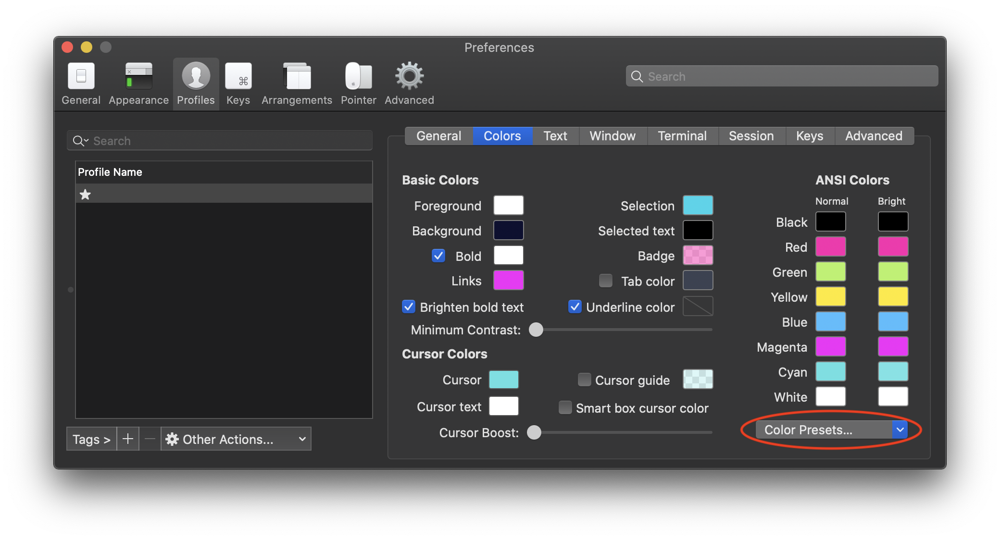

# MY CONFIG

##### All my Mac configurations for a fast installation from zero with brew ! 

# 1. Install
- install [iTerm](https://iterm2.com)
- install [Brew](https://brew.sh)
- install [Fontpowerline](https://github.com/powerline/fonts)
- Install [1984 theme iTerm](https://github.com/covertbert/iterm2-1984)

# 2. Run command 
```sh
# Only after brew install
curl -sSL https://raw.githubusercontent.com/alexlechot/-myConfig/master/install.sh | sh
```

<br><hr><br>

# About my config
#### Not in install.sh
- [ ] [Adobe Creative Cloud](https://www.adobe.com/ch_fr/creativecloud/desktop-app.html)
- [ ] Spark (App Store) 
- [ ] xCode (App Store)
- [ ] Pages (App Store)
- [ ] Numbers (App Store)
- [ ] MindNode (App Store)

<br><hr><br>

# Brew command reminders
```sh
 brew search packages
 brew install packages
 brew cask install packages
 brew remove packages
 brew cask remove 
 # verify if brew config is ok
 brew doctor
```

<br><hr><br>

# iTerm configuration
#### Appearance
  
  
#### Profile

#### Theme [1984 theme iTerm](https://github.com/covertbert/iterm2-1984)

#### Text

#### Bar


<br><hr><br>

# Terminal abbrevation in iTerm
```sh
fish_config
```

```sh
yarn global upgrade; yarn cache clean
brew update; brew upgrade; brew cleanup; brew cu -facy; rm -rf (brew --cache)
```

<br><hr><br>

# Local Server (Docker & Apaxy V2)
Copy past "Labo" file there: ~/

```sh
cd /Labo/docker-lab/ 
docker-compose up -d
```


<br><hr><br>

# Alfred Settings
  
  
  
  
  

<br><hr><br>

# Visual Studio Code
### Tacking back all my packages, themes, etc...
1. install Settings Sync 
2. past your Github Tocken & Gist 


<br><hr><br>

# Add "Open In Terminal" in Finder bar
#### Apple settings
  

<br><hr><br>

&copy; 2019 [Alexia Lechot](https://krakenwave.ch)
